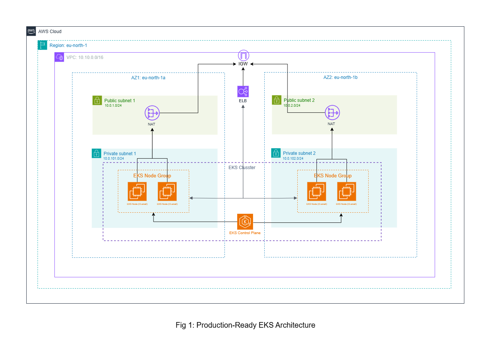

# EKS cluster with Terraform + Nginx Ingress + TLS

Provisioned an EKS cluster using Terraform and deployed an Nginx application with Ingress and TLS using Cert-Manager.



This project sets up an **EKS cluster** using **Terraform** and deploys an NGINX application using **Helm**, **Ingress**, and **Cert-Manager** with self-signed TLS. It provides a straightforward, ready to use workflow from cluster provisioning to application deployment.

It includes:

- Full Terraform EKS infrastructure setup
- Helm‑based deployment for nginx app
- NGINX Ingress Controller installation
- Cert‑Manager with a self‑signed ClusterIssuer
- Remote backend for terraform state
- Dynamic ELB hostname injection into Ingress
- Automatic HTTPS configuration using TLS secrets
- Supports deployment from public and private container registries

---

## Project Structure

```
├── envs/
│   └── dev/
│       ├── main.tf
│       ├── backend.tf
│       ├── provider.tf
│       └── variables.tf

├── modules/
│   ├── eks/
│   │   ├── main.tf
│   │   ├── outputs.tf
│   │   └── variables.tf
│   └── vpc/
│       ├── main.tf
│       ├── outputs.tf
│       └── variables.tf

├── helm/
│   ├── charts/
│   ├── Chart.yaml
│   ├── values.yaml
│   └── templates/
│       ├── deployment.yaml
│       ├── service.yaml
│       ├── ingress.yaml
│       ├── httproute.yaml
│       ├── hpa.yaml
│       └── serviceaccount.yaml

├── scripts/
│   └── deploy.sh

├── selfsigned.yaml
├── .pre-commit-config.yaml
├── .terraform-version

```

---

## Deployment steps

### Requirements

- [Terraform v1.8.5](https://developer.hashicorp.com/terraform/install)
- [kubectl](https://kubernetes.io/docs/tasks/tools/)
- [Helm](https://helm.sh/docs/intro/install/)
- AWS Access Key & Secret Key
- [AWS CLI](https://docs.aws.amazon.com/cli/latest/userguide/getting-started-install.html)

### Clone the repo

```bash
git clone https://github.com/Naresh-chandanbatve/eks-terraform.git
cd eks-terraform
```

### Install pre-commit hook (optional can be sckipped if not production)

```bash
pip install pre-commit
python -m pre_commit install
```

### configure AWS cli

```bash
aws configure
```

paste AWS access id and secret

### Edit terraform.tfvars values based on your need

```
cp envs/dev/terraform.tfvars.example envs/dev/terraform.tfvars
```

### configure backend.tf for hcp, s3 or any backend and edit values

#### Option 1: HCP

```
cp backend.tf.example.hcp backend.tf
```

#### Option 2: AWS S3 Backend

```
cp backend.tf.example.s3 backend.tf
```

### stable terraform version in .terraform-version

```
1.8.5
```

### Initialize Terraform

```bash
cd envs/dev/
terraform init
```

### Validate the configuration

```bash
terraform validate
```

### Provision the EKS cluster

```bash
terraform apply -auto-approve
```

### Configure kubectl

Terraform output will include:

```
aws eks update-kubeconfig --region <region> --name <cluster_name>
```

Run:

```bash
aws eks update-kubeconfig --region eu-north-1 --name dev-eks-cluster
```

Verify:

```bash
kubectl get nodes
```

---

### Install NGINX Ingress Controller

```bash
helm repo add ingress-nginx https://kubernetes.github.io/ingress-nginx
helm install nginx ingress-nginx/ingress-nginx -n ingress-nginx --create-namespace
```

### Install Cert‑Manager

```bash
helm repo add jetstack https://charts.jetstack.io
helm upgrade --install cert-manager jetstack/cert-manager \
  --namespace cert-manager \
  --create-namespace \
  --set installCRDs=true
```

### Apply Self‑Signed ClusterIssuer

```bash
kubectl apply -f selfsigned.yaml
```

if you are planning to use in production then selfsigned not recommended, you can use [Let's Encrypt cluster issuer](https://cert-manager.io/docs/configuration/acme).

### Edit values.yaml

- Edit values.yaml file based on your needs.
- Here we have used simple nginx image you can modify it to your own image supports any public and private registries.
- If using private registry create k8s secret using

```
kubectl create secret docker-registry registry-secret \
  --docker-server=<REGISTRY_URL> \
  --docker-username=<USERNAME> \
  --docker-password=<PASSWORD> \
  --docker-email=<EMAIL>
```

### Run deploy script

```bash
./scripts/deploy.sh
```

---

## Accessing the application

Open in browser:

```
https://<AWS-ELB-HOSTNAME>
```

TLS is automatically generated by Cert‑Manager.

---

## Security Considerations

- EKS API access is controlled using CIDR blocks (`cluster_endpoint_public_access_cidrs`)
- Public API access can be enabled via `cluster_endpoint_public_access = true`
- Restrict API access to specific IPs instead of allowing open access
- TLS enabled using Cert-Manager
- Supports private container registries via Kubernetes secrets
- IAM roles used for node access control

> Avoid using `0.0.0.0/0` in production environments.

---

## Production Considerations

- Replace self-signed certificates with [Let's Encrypt](https://cert-manager.io/docs/configuration/acme) for your domain
- Use remote backend with state locks for Terraform state
- Enable autoscaling for workloads and nodes

---

## Tradeoffs

- Self-signed TLS used for simplicity (not recommonded in production)
- Managed EKS used to reduce operational overhead

---

## License

MIT License

---

## Contributing

Pull requests and enhancements are always welcomed!
