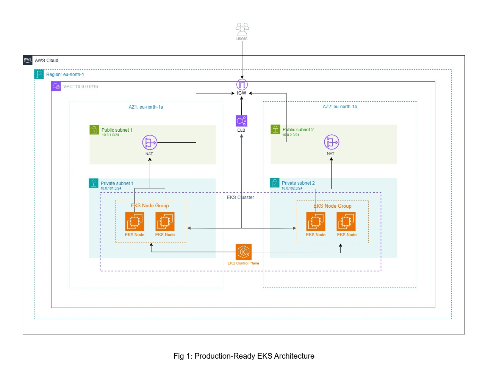

# Production-Grade EKS Platform with Autoscaling & Observability

> Designed and built a scalable Kubernetes platform on AWS focusing on cost optimization, observability, and production-grade deployment practices.

[](https://terraform.io)
[](https://aws.amazon.com/eks/)
[](https://helm.sh)
[](https://github.com/features/actions)

---

## Key Highlights

| Area                  | What Was Built                                                                        |
| --------------------- | ------------------------------------------------------------------------------------- |
| **Autoscaling**       | Dynamic node provisioning with Karpenter — cost-optimized over static node groups     |
| **Observability**     | Full Prometheus + Grafana stack with real-time cluster and app metrics                |
| **TLS Automation**    | cert-manager with self-signed certs (dev) — extensible to Let's Encrypt in production |
| **CI/CD**             | GitHub Actions pipeline: build → tag → push → deploy via Helm                         |
| **Ingress**           | NGINX Ingress Controller with AWS ALB for external traffic routing                    |
| **High Availability** | Multi-AZ EKS architecture with decoupled frontend/backend deployments                 |

---



---

## Architecture Decisions

- **Karpenter**
  - karpenter is fast, dynamic and cost optimized but has complexity and Requires additional configuration
  - consider Cluster Autoscaler if you have predictable workload or want simplicity

- **Helm for application deployment**
  - Used helm for highly portable and configurable deployments across environments

- **Self signed ClusterIssueer**
  - Currently self signed cluster issuser is used for simplicity.
  - Use trusted issuer like Let's Encrypt in production.

- **Prometheus + Grafana stack**
  - Used for vendor-independent Kubernetes monitoring with deep cluster-level visibility
  - Widely adopted in Kubernetes ecosystems
  - AWS CloudWatch can be used for tighter AWS integration

---

## ⚡ Quick Start

> **Prerequisites:**

- [Terraform v1.8.5](https://developer.hashicorp.com/terraform/install)
- [kubectl](https://kubernetes.io/docs/tasks/tools/)
- [Helm](https://helm.sh/docs/intro/install/)
- [AWS Access Key & Secret Key](https://docs.aws.amazon.com/IAM/latest/UserGuide/id_credentials_access-keys.html)
- [AWS CLI](https://docs.aws.amazon.com/cli/latest/userguide/getting-started-install.html)

```bash
# 1. Clone the repo
git clone https://github.com/your-username/eks-platform.git
cd eks-platform

# 2. Provision infrastructure
cd envs/dev
terraform init
terraform apply -auto-approve

# 3. Configure kubectl
aws eks update-kubeconfig --name eks-dev-cluster --region us-east-1

# 4. Deploy application stack
helm upgrade --install app ./helm/app -f helm/app/values.dev.yaml
```

Full setup guide → [docs/installation.md](docs/installation.md)

---

## 🚀 CI/CD Pipeline

```
  Push to main
      │
      ▼
  Build Docker images (frontend + backend)
      │
      ▼
  Tag with commit SHA (e.g., sha-a3f9c12)
      │
      ▼
  Push to Container Registry (ECR / GHCR)
      │
      ▼
  helm upgrade --install → EKS

```

- Zero-downtime deployments via rolling update strategy
- Commit SHA tagging ensures full traceability — every image is pinned
- Failed deployments auto-rollback via Helm revision history

Pipeline details → [docs/cicd.md](docs/cicd.md)

---

## 🏭 Production Considerations

These are known gaps intentionally deferred for dev environment simplicity:

| Area            | Current State                           | Production Target                         |
| --------------- | --------------------------------------- | ----------------------------------------- |
| TLS             | Self-signed cert-manager                | Let's Encrypt via ACME                    |
| API Access      | 0.0.0.0/0                               | CIDR-restricted per team                  |
| Terraform State | S3 backend with locking                 | S3 backend with locking                   |
| Secrets         | Helm values                             | AWS Secrets Manager / ESO                 |
| HPA             | Not configured                          | CPU/memory-based autoscaling per workload |
| Karpenter       | Aggressive consolidation to reduce cost | Tune carefully to avoid disruption        |

---

## Security

- IAM roles scoped per node pool — no wildcard permissions
- TLS termination at NGINX ingress — backend services are never exposed directly
- Private container registry support via Kubernetes image pull secrets
- Security group rules limit node-to-node and pod-to-pod traffic

---

## Project Structure

```
├── envs/
│   └── dev/
│       ├── main.tf
│       ├── backend.tf
│       ├── provider.tf
│       └── variables.tf

├── modules/
│   ├── eks/
│   │   ├── main.tf
│   │   ├── outputs.tf
│   │   └── variables.tf
│   └── vpc/
│       ├── main.tf
│       ├── outputs.tf
│       └── variables.tf

├── helm/
│   ├── charts/
│   ├── Chart.yaml
│   ├── values.yaml
│   └── templates/
│       ├── backend-deployment.yaml
│       ├── backend-service.yaml
│       ├── frontend-deployment.yaml
│       ├── frontend-service.yaml
│       ├── ingress.yaml
│       ├── postgres-deployment.yaml
│       ├── postgres-service.yaml
│       ├── redis-deployment.yaml
│       ├── redis-service.yaml

├── scripts/
│   └── deploy.sh

├── selfsigned.yaml
├── inflate-deployment.yaml
├── .pre-commit-config.yaml
├── .terraform-version

```

---

## Autoscaling with Karpenter

The example `inflate-deployment.yaml` Simulates high resource scheduling by requesting CPU resources:

- Forces pods into Pending state
- Karpenter provisions new nodes automatically
- Pods get scheduled without manual intervention

  > apply with `kubectl apply -f inflate-deployment.yaml`

---

## License

MIT License

---

## Contributing

Pull requests and enhancements are always welcomed!
